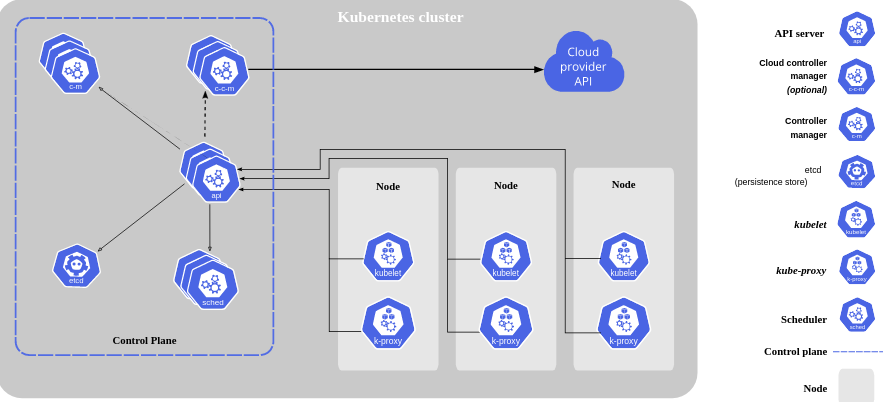

Componentes de Kubernetes
===========================

Cuando implementa Kubernetes, obtiene un clúster.

Un clúster de Kubernetes consta de un conjunto de máquinas Worker, llamado nodos, que ejecutan aplicaciones en contenedores. Cada clúster tiene al menos un nodo Worker.

El (los) nodo(s) Worker(s) alojan los Pods que son los componentes de la carga de trabajo de la aplicación. El Control Plane maneja los nodos Worker y los pods en el clúster. En entornos de producción, el Control Plane generalmente se ejecuta en varios equipos y un clúster generalmente ejecuta varios nodos, lo que brinda tolerancia a fallas y alta disponibilidad.

Este documento describe los diversos componentes que necesita para tener un clúster de Kubernetes completo y funcional.

Aquí está el diagrama de un clúster de Kubernetes con todos los componentes vinculados.

Control Plane Components
++++++++++++++++++++++++++++++++++++++++

Los componentes del Control Plane toman decisiones globales sobre el clúster (por ejemplo, el scheduling), además de detectar y responder a los eventos del clúster (por ejemplo, iniciar un nuevo Pods  cuando una replica de una deployment no esté con fallas).

Los componentes del Control Plane se pueden ejecutar en cualquier máquina del clúster. Sin embargo, para simplificar, los scripts de configuración generalmente inician todos los componentes del Control Plane en la misma máquina y no ejecutan contenedores de usuario en esta máquina. Consulte Creación de clústeres de alta disponibilidad con kubeadm para obtener un ejemplo de configuración del Control Plane que se ejecuta en varias máquinas virtuales.

**kube-apiserver**
El servidor de API es un componente de Control Plane de Kubernetes que expone la API de Kubernetes. El servidor de API es el Frontend del Control Plane de Kubernetes, es decir, por el pasan todas las peticiones de los demás componentes.

La implementación principal de un servidor API de Kubernetes es kube-apiserver. kube-apiserver está diseñado para escalar horizontalmente, es decir, escala mediante la implementación de más instancias. Puede ejecutar varias instancias de kube-apiserver y equilibrar el tráfico entre esas instancias.

La API es la que atiende las solicitudes enviadas por la interfaz humana cuando escribe un comando. Esta API es capaz de interpretar los comando y acepta request en formato JSON, es decir a nivel de programación podemos comunicarnos con esta API. En resumen la API habla es en JSON.

**etcd**
Almacén de claves consistente y de alta disponibilidad, utilizado como almacén de respaldo de Kubernetes para todos los datos del clúster. Aquí se almacena toda la metadata del cluster.

Si su clúster de Kubernetes usa etcd como almacén de respaldo, asegúrese de tener un plan de respaldo para esos datos.

https://kubernetes.io/docs/tasks/administer-cluster/configure-upgrade-etcd/#backing-up-an-etcd-cluster

Puede encontrar información detallada sobre etcd en la documentación oficial 

https://etcd.io/docs/

**kube-scheduler**
Componente del Control Plane que busca la creación de un nuevo Pods que no tenga asignado un nodo para que se ejecute.

Los factores que se tienen en cuenta para las decisiones del Scheduling incluyen: requisitos de recursos individuales y colectivos, restricciones de hardware/software/políticas, especificaciones de afinidad y anti-afinidad, localidad de datos, interferencia entre cargas de trabajo y fechas límite.

**kube-controller-manager**
Componente del Control Plane que controla la ejecución de Procesos.

Lógicamente, cada controlador es un proceso separado, pero para reducir la complejidad, todos se compilan en un solo binario y se ejecutan en un solo proceso.

Algunos tipos de estos controladores son:

Node Controller: responsable de identificar y responder cuando los nodos se caen.

Jobs Controller: busca objetos de trabajo que representan tareas únicas y luego crea pods para ejecutar esas tareas hasta su finalización.

Endpoint Controller: completa el objeto de endpoint (es decir, se une a servicios y pods).

Service Account & Token controllers: cree cuentas predeterminadas y tokens de acceso a la API para nuevos espacios de nombres

**cloud-controller-manager**
Es un componente de Kubernetes Control Plane que incorpora la lógica de control específica de la nube. El cloud-controller-manager le permite vincular su clúster a la API de su proveedor de nube y separa los componentes que interactúan con esa plataforma de nube de los componentes que solo interactúan con su clúster.
Cloud-controller-manager solo ejecuta controladores que son específicos de su proveedor de nube. Si está ejecutando Kubernetes en sus propias instalaciones o en un entorno de aprendizaje dentro de su propia PC, el clúster no tiene un administrador de controlador en la nube.

Al igual que con kube-controller-manager, cloud-controller-manager combina varios lazos de control lógicamente independientes en un solo binario que se ejecuta como un solo proceso. Puede escalar horizontalmente (ejecutar más de una copia) para mejorar el rendimiento o para ayudar a tolerar fallas.

Los siguientes controladores pueden tener dependencias de proveedores en la nube:

Node Controller: para verificar el proveedor de la nube para determinar si un nodo se ha eliminado en la nube después de que deja de responder

Route Controller: para configurar rutas en la infraestructura de nube subyacente

Service Controller: para crear, actualizar y eliminar equilibradores de carga de proveedores de nube

Node Components
++++++++++++++++++

De Node Components se ejecutan en cada nodo, manteniendo los pods en ejecución y proporcionando el entorno de ejecución de Kubernetes.

**kubelet**
Es un agente que se ejecuta en cada nodo del clúster. Se asegura que los contenedores estén corriendo en un Pod.

El kubelet toma un conjunto de PodSpecs que se proporcionan a través de varios mecanismos y asegura que los contenedores descritos en esas PodSpecs estén funcionando y en buen estado. El kubelet no administra contenedores que no fueron creados por Kubernetes.

**kube-proxy**
kube-proxy es un proxy de red que se ejecuta en cada nodo en su clúster, parte de implementación del Kubernetes Service concept.

kube-proxy mantiene las reglas de red en los nodos. Estas reglas de red permiten la comunicación de red con sus pods desde sesiones de red dentro o fuera de su clúster.

kube-proxy usa la capa de filtrado de paquetes del sistema operativo si hay una y está disponible. De lo contrario, kube-proxy reenvía el tráfico en sí. Se encarga de todo el servicio de Red del Cluster de Kubernetes.

**Container runtime**
El Container runtime es el software responsable de ejecutar los contenedores.

Kubernetes admite varios tiempos de Container runtime: Docker, containerd, CRI-O y cualquier implementación de Kubernetes CRI (Container Runtime Interface) 

Addons
+++++++++++
Los complementos usan recursos de Kubernetes (DaemonSet, Despliegue, etc.) para implementar funciones de clúster. Debido a que estos brindan características a nivel de clúster, los namespaced resources para complementos pertenecen al kube-system namespace.

Los complementos seleccionados se describen a continuación; para obtener una lista ampliada de complementos disponibles, consulte Complementos .

https://kubernetes.io/docs/concepts/cluster-administration/addons/

**DNS**
Si bien los otros complementos no son estrictamente necesarios, todos los clústeres de Kubernetes deben tener DNS de clúster, ya que muchos ejemplos se basan en él.

Cluster DNS es un servidor DNS, además de los otros servidores DNS en su entorno, que proporciona registros DNS para los servicios de Kubernetes.

Los contenedores iniciados por Kubernetes incluyen automáticamente este servidor DNS en sus búsquedas de DNS.

**Web UI (Dashboard)**
Dashboard es una interfaz de usuario basada en web de uso general para clústeres de Kubernetes. Permite a los usuarios administrar y solucionar problemas de aplicaciones que se ejecutan en el clúster, así como del clúster en sí.

**Container Resource Monitoring**
Container Resource Monitoring registra métricas genéricas de series de tiempo sobre contenedores en una base de datos central y proporciona una interfaz de usuario para examinar esos datos.

**Cluster-level Logging **
Un mecanismo de registro a nivel de clúster es responsable de guardar los registros del contenedor en un almacén de registros central con interfaz de búsqueda / navegación
