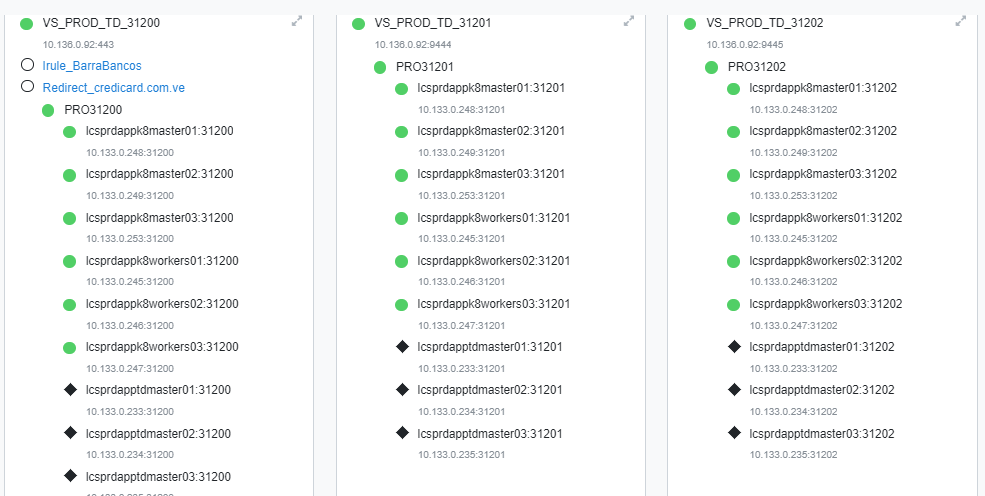

TroubleShooting
========================

Los nodos de aplicación 
++++++++++++++++++++++

	10.133.0.245 lcsprdappk8workers01 

	10.133.0.246-lcsprdappk8workers02 

	10.133.0.247-lcsprdappk8workers03 

	10.133.0.248-lcsprdappk8master01 

	10.133.0.249-lcsprdappk8master02 

	10.133.0.253-lcsprdappk8master0310

	10.133.0.236-lcsprdapptdregistry01 - Registry Images port 4443

Nodo de Gestor de Contenido
++++++++++++++++++++

	10.133.0.12 Admin de Contenidos http://10.133.0.12/

Servidores LDAP
+++++++++++++++++

	10.133.0.237-lcsprdapptdldap01 port 636 

	10.133.0.238-lcsprdapptdldap02 port 636

Servidor Base de Datos Postgres
++++++++++++++++++++++++++++++
Averiguar cuales son

Servidor AS400 Base de Datos DB2.
+++++++++++++++++++++++++++++

F5
+++++++++

El portal  www.credicard.com.ve están conformado por los siguientes Virtual Server:

Los servidores con diamante en negro es porque estan desactivados de acuerdo al área funcional  y serán eliminados cuando se reciba el feedback.

Manejador de Contenido del portal:

El portal no se verá afectado a menos que:

	Todos sus nodos no le respondan al F5 por sus puertos especificados. 

	Que el servicio de CANTV presente una caída.

	Que los DNS no respondan-CANTV.

	Alguna incidencia con los Router de borde, IPS, Firewall y F5 las cuales son escasas ya que Credicard tiene Alta disponibilidad con todos los equipos mencionados.

Empecemos
+++++++++++

Se debe verificar en un navegador las siguiente URL, de los servidores master, porque las peticiones de los clientes pasan primero por el F5 y luego son dirigidos a los master por el puerto 31200, aqui debemos ver en pleno todo el contenido del portal.

	https://10.133.0.248:31200/

	https://10.133.0.249:31200/

	https://10.133.0.253:31200/

Si los master responden bien y desde la calle no se visualiza el portal, se debe mandar de una vez que verifiquen el F5 de forma paralela mientras continuamos con el Troubleshooting.

También se debe verificar los worker.

	https://10.133.0.245:31200/

	https://10.133.0.246:31200/

	https://10.133.0.247:31200/

Nos conectamos al servidor 10.133.0.248-lcsprdappk8master01, que desde ahí podemos ejecutar todos los comandos de administración, kubernetes.::

	[jsuarez@lcsprdappk8master01 ~]$ sudo bash

Con el siguiente comando debemos ver el STATUS y todos los nodos deben estar **Ready**
::

	[root@lcsprdappk8master01 jsuarez]# kubectl get nodes
	NAME                   STATUS   ROLES    AGE   VERSION
	lcsprdappk8master01    Ready    master   74d   v1.19.8
	lcsprdappk8master02    Ready    master   74d   v1.19.8
	lcsprdappk8master03    Ready    master   74d   v1.19.8
	lcsprdappk8workers01   Ready    worker   73d   v1.19.8
	lcsprdappk8workers02   Ready    worker   73d   v1.19.8
	lcsprdappk8workers03   Ready    worker   73d   v1.19.8

Sin no los vemos **Ready** verificamos:
	Que el servidor este en linea.
	Si el servidor es un master debemos asegurar que los siguientes servicios estén operativos en el systemd; kubelete, docker, ETCD, NTP
	Si el servidor es un worker debemos asegurar que los siguientes servicios estén operativos en el systemd; kubelete, docker, NTP
	Verificar que la fecha este correcta

Verificamos los Deploy y o aplicativos, los cuales son tres (3):

ccr-pic-backend-iseries

ccr-pic-backend

ccr-pic-frontend

::

	[root@lcsprdappk8master01 jsuarez]# kubectl get deploy
	NAME                          READY   UP-TO-DATE   AVAILABLE   AGE
	ccr-pic-backend-iseries1997   3/3     3            3           22d
	ccr-pic-backend2025           3/3     3            3           12d
	ccr-pic-frontend2024          3/3     3            3           12d

También este comando muestra lo mismo::

	[root@lcsprdappk8master01 cgomez]# kubectl get deployments.apps
	NAME                          READY   UP-TO-DATE   AVAILABLE   AGE
	ccr-pic-backend-iseries1997   3/3     3            3           23d
	ccr-pic-backend2025           3/3     3            3           13d
	ccr-pic-frontend2024          3/3     3            3           13d

Cada deploy esta configurado para que se replique de forma simultanea 3 veces. esto se resumen en la creación de 3 pod de una aplicacion.

En el comando anterior la Columna READY nos indica que de ese Deploy existen 3 replicas configuradas y de las cuales las 3 replicas estan funcionando. OJO un Deploy puede estar replicado en un mismo nodo y esto depende por la cantidad de recursos de computo o carga de trabajo en ese momento, es decir, en un nodo (worker) puede estar corriendo los 3 pods y no en los demas nodos (worker). 

Los Pods son los contenedores y los pod se pueden ejecutar todos en un worker, tal como ya se dijo motivado a la capacidad y demanda de computo que tenga en ese momento el minions

Puede se posible que un nodo (worker) NO este corriendo un aplicativo, es decir, no tenga un pod.

**hay cuatro desplieque pero cada uno tiene tres replicas.** NO lo tengo claro

Con el comando kubectl get pods, certificamos que de cada Deploy se este replicando 3 veces y este Running.::

	[root@lcsprdappk8master01 cgomez]# kubectl get pods
	NAME                                           READY   STATUS    RESTARTS   AGE
	ccr-pic-backend-iseries1997-85cbd6f9d4-2dfvq   1/1     Running   0          23d
	ccr-pic-backend-iseries1997-85cbd6f9d4-f6q7j   1/1     Running   0          23d
	ccr-pic-backend-iseries1997-85cbd6f9d4-xtclc   1/1     Running   0          23d
	ccr-pic-backend2025-d584d7d6-j4j28             1/1     Running   0          10d
	ccr-pic-backend2025-d584d7d6-pwbls             1/1     Running   0          10d
	ccr-pic-backend2025-d584d7d6-qkns4             1/1     Running   0          10d
	ccr-pic-frontend2024-5dbdcf855-htjdv           1/1     Running   0          12d
	ccr-pic-frontend2024-5dbdcf855-n8d4z           1/1     Running   0          12d
	ccr-pic-frontend2024-5dbdcf855-zpnwn           1/1     Running   0          13d

Asegurar que los master tengan conexión con el servidor registry 10.133.0.236-lcsprdapptdregistry01 - Registry Images por el port 4443. Recuerda que si kubernet intenta hacer un deploy buscar este servidor y si no lo encuentra el ciclo no culmina y se genera fallas.

**Método de reinicio controlado** Este comando lo ejecute en desarrollo y calidad y lo que hace es ejecutar el reinicio de todos los pods de manera controlada del deployment que le asignen (OJO primero sacar los logs debido a que después del reinicio se elimina el log en ejecución)

Para **sacar los LOGs** hay varios métodos este seria uno::

	kubectl  logs ccr-pic-backend2025-d584d7d6-j4j28 > log
	kubectl  logs ccr-pic-backend-iseries1997-85cbd6f9d4-2dfvq > log

Otro método, inicias dentro del pod y desde adentro comprimes el directorio /public/logs/::

	kubectl exec ccr-pic-backend2025-d584d7d6-ll2gw -it -- /bin/sh

Te sales del pod y con el siguiente comando copias el archivo comprimido en donde estas parado::

	kubectl cp ccr-pic-backend2025-d584d7d6-ll2gw:/public/logs.tar.gz .

La otra técnica y es la **recomendada** es utilizar el script llamado aplication_log.sh, seleccionar de cual pod quiere tomar los logs, los logs seran arrojados en un archivo en donde estas parado, tomar en cuenta que este proceso es lento

	aplication_log.sh

**IMPORTANTE:** Los LOGs se sacan de todos los pods, ejemplo, del Backend hay tres pod ejecutando, pues de esos 3 pods se debe tomar los logs

Hay dos (2) formas de ver los logs, uno muestra todo el contenido y culmina, el otro muestra todo el contenido y se queda vivo leyendo el log::

	# kubectl logs ccr-pic-backend2025-d584d7d6-j4j28

	# kubectl logs -f ccr-pic-backend2025-d584d7d6-j4j28

**(Certificar que siempre este disponible y con conexión con el servidor 10.133.0.236-lcsprdapptdregistry01 - Registry Images)**::

Certificar la disponibilidad del servidor 10.133.0.236-lcsprdapptdregistry01 - Registry Images

Realizar un telnet desde el master en donde nos encontramos conectados, hacia la IP 10.133.0.236 por el puerto 4443 y debe conectar::

	sudo telnet 10.133.0.236 4443

Si lo anterior no es exitoso para las conexiones contra el servidor de 10.133.0.236-lcsprdapptdregistry01 - Registry Images, deberá conectar al servidor 10.133.0.236 por ssh y consultar que el contenedor registry se encuentra arriba::

	docker ps
	CONTAINER ID        IMAGE               COMMAND                  CREATED             STATUS              PORTS                              NAMES
	2caf4a698efe        registry:2          "/entrypoint.sh /e..."   15 months ago       Up 2 months         0.0.0.0:4443->4443/tcp, 5000/tcp   registry

La salida anterior evidencia que esta bien el contenedor de Registry.

Si al consultar ve algo como esto, deberá iniciar el contenedor::

	docker ps
	CONTAINER ID        IMAGE               COMMAND             CREATED             STATUS              PORTS               NAMES

Iniciar el contenedor de registry::

	docker start registry
	registry

Para reiniciar el contenedor de registry::

	docker stop registry
	docker start registry

Continuamos con el reinicio luego de extraer los LOGs y certificar que Registry esta operativo::

	kubectl scale deployment ccr-pic-backend2025 --replicas=0 
	kubectl scale deployment ccr-pic-backend2025 --replicas=3

Este comando sustituye la mala práctica aplicada en la ejecución anterior::

	kubectl rollout restart deployment [deployment_name]

Cual es la diferencia, el comando con scale deployment lo que hace es los elimina a todos de forma simultanea y luego hace nuevamente el deploy, pero con el comando con los argumentos rollout restart deployment, va eliminando de forma controlada los pod y luego que lo elimina hace el deploy y así va de forma sucesiva y controlada hasta eliminar todos los pod y desplegarlos nuevamente. 

El reinicio demora pocos segundos, porque los pod son muy livianos. Recuerda que debes asegurar que tengas conexión con el servidor de 10.133.0.236-lcsprdapptdregistry01 - Registry Images

Debe existir con conexión con el LDAP siempre. Se debe indagar mas de cuales son los servidores y puerto.

Conexión al LDAP se debe monitorear, Si hay fallas o no hay conexión con el LDAP el pod ccr-pic-backend se empezara a ver errores de crash en los LOGS.

El pod ccr-pic-backend-iseries es un Tomcat que se dispara solo, es decir, microservicios que son evocados por un Java y este levanta de forma temporal un servicio de Tomcat. este pod lo único que hace es ir contra el DB2 del AS400.

Dependencia para su funcionamiento: 
	Iserie del AS400 BD2

El pod ccr-pic-backend solo tiene un NodeJ. Este pod utiliza estos componentes LDAP y el Exchange y la BD Postgres y unidigital para las facturas de POS. Siempre se debe ver los LOG de los 3 pod del Backend, porque hasta los momentos ahí es donde se ha visto las fallas con el LDAP.

Dependencia para su funcionamiento: 
	LDAP backend

	BD	backend

	Gestor de contenido backend

	API unidigital backend

	API con tedexi OTP, genera código enviado al teléfono y lo colocas en el navegador

	el OTP no es el de credicard, es desarrollo

El pod ccr-pic-frontend es un ngix que no se modifica porque esta sellado. El solo muestra el contenido de la imagen del Tepuy, el no es restringido por otro pod o BD. El Frontend se comunica con el Backend y el gestor de contenidos, pero no se limita si ellos no estan, el manda la petición del usuario a comunicarse con el manejador de contenido y con el backend.

Frontend funciona solo, no necesita nadie. Si el manejador de contenido Directus no esta operativo, el FrontEnd solo mostrara la imagen del tepuy y no te permite bajar para ver el resto

Dependencia para su funcionamiento:
	funciona solo, no necesita nadie

Con kubectl  get services ayuda identificar un Deploy en que pod se encuentra y por donde esta exponiendo la aplicación (Port),  puedo hacer el troubleshooting llamando al pod y ese puerto en un navegador.

	[root@lcsprdappk8master01 cgomez]# kubectl  get services
	NAME                          TYPE        CLUSTER-IP       EXTERNAL-IP   PORT(S)         AGE
	ccr-pic-backend-iseries1997   NodePort    10.104.189.144   <none>        443:31202/TCP   23d
	ccr-pic-backend2025           NodePort    10.96.205.240    <none>        443:31201/TCP   13d
	ccr-pic-frontend2024          NodePort    10.96.136.119    <none>        443:31200/TCP   13d
	kubernetes                    ClusterIP   10.96.0.1        <none>        443/TCP         74d

Nos Vamos a un navegado y vamos verificando las url, vemos que son todas las ip de los master y worker y cada uno vamos asociando los puertos y debemos ver un resultado en el navegador.

	https://10.133.0.248:31202/

	https://10.133.0.248:31201/

	https://10.133.0.248:31200/

	https://10.133.0.249:31202/

	https://10.133.0.249:31201/

	https://10.133.0.249:31200/

	https://10.133.0.253:31202/

	https://10.133.0.253:31201/

	https://10.133.0.253:31200/

	https://10.133.0.245:31202/

	https://10.133.0.245:31201/

	https://10.133.0.245:31200/

	https://10.133.0.246:31202/

	https://10.133.0.246:31201/

	https://10.133.0.246:31200/

	https://10.133.0.247:31202/

	https://10.133.0.247:31201/

	https://10.133.0.247:31200/

Evidencia de lo que debemos ver

Recordemos que el Frontend utiliza el servidor 10.133.0.12 Admin de Contenidos para culminar de mostrar todo el contenido del portal, este Admin de contenidos se llama Directus y nosotros solo tenemos el Apache, por lo tanto solo debemos verificar que se muestre la URL::

	http://10.133.0.12/admin/#/login

Esto es otro tema de Gitlab que se debe mejorar
+++++++++++++++++++++++++++++++++++++++

Deploy anterior del Git ir solo al check de redeploy eso demora solo 2 seg

son comandos ssh hacia el master y hay una variable en git que dice cual es master
y hay una relacion de confia.

se conecta al contenedor ir a public/log y traer todos los logs, para eso tenemos el script

En gitlab requiere una relacion confianza con el master y el master requiero una relacion confianza con el registry

Resumen de los comandos más utilizados.
++++++++++++++++++++++++++++++++++++++

::

	dashboard status
	kubectl get nodes
	kubectl get deploy
	kubectl get pods
	kubectl get deployments.apps
	kubectl get services
	kubectl logs ccr-pic-backend2025-d584d7d6-j4j28
	kubectl logs -f ccr-pic-backend2025-d584d7d6-j4j28

Algunos datos para evaluar luego

ConnectionError: 1__ldaps://10.133.0.237:636 closed
	free -h && echo 3 > /proc/sys/vm/drop_caches && sync && free -h
	systemctl status slapd
	vi /etc/sysconfig/slapd
	cd /var/lib/ldap
	  466  ldapsearch -x -b ou=users,dc=credicard,dc=com,dc=ve mail=yy2305@hotmail.com pwdPolicySubentry -LLL
	  467  ldapsearch -x -b ou=users,dc=credicard,dc=com,dc=ve mail=z* mail | grep mail: | awk '{print $2}' | sort >> correos-z.txt

	/var/lib/ldap
	vi /etc/sysconfig/slapd

